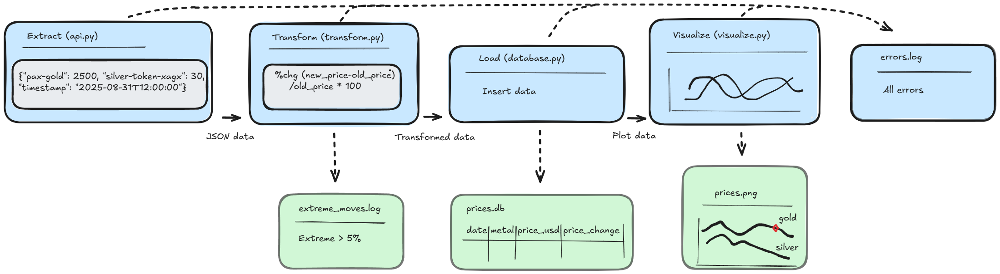

# Gold and Silver Price ETL Pipeline

## Overview

This project, developed as part of a Python programming course, implements an automated ETL (Extract, Transform, Load) pipeline to fetch, process, and store gold and silver prices from the CoinGecko API, using Python. The pipeline retrieves daily prices for gold (PAXG) and silver (silver-token-xagx), transforms them (e.g., percentage change calculation), stores the data in a SQLite database, and visualizes the results as a line plot with dual y-axes. It includes error handling, logging, automated tests, and scheduling via CRON on Ubuntu. Project focus is on code structure, modularity, testing and automation and not so much on the data.

## Features

- **Extract**: Fetches real-time and historical prices for gold and silver from CoinGecko API.
- **Transform**: Calculates daily percentage changes, and flags extreme movements (>5%).
- **Load**: Stores data in a SQLite database with checks to avoid duplicate entries.
- **Visualization**: Generates a line plot (gold on left y-axis, silver on right y-axis) with marked extreme movements.
- **Logging**: Logs application errors and info to `errors.log`, extreme price movements to `extreme_moves.log`, and CRON job output to `cron.log`.
- **Automation**: Scheduled via CRON to run multiple times daily using a shell script wrapper.
- **Testing**: Unit tests for data transformations, API handling, and database operations.
- **Backup**: Script to back up the SQLite database.

## Project Structure

```
gold_silver_etl/
├── app/
│   ├── __init__.py
│   ├── main.py           # Orchestrates ETL pipeline
│   ├── api.py            # Fetches data from CoinGecko API
│   ├── transform.py      # Processes data (change calculations)
│   ├── database.py       # Manages SQLite database operations
│   ├── visualize.py      # Creates price plot with matplotlib
│   └── logger.py         # Configures logging
├── config/
│   └── config.py         # API keys, DB path, and constants
├── data/
│   └── prices.db         # SQLite database
├── logs/
│   ├── errors.log        # Application error and info logs
│   ├── extreme_moves.log # Extreme price movement logs
│   └── cron.log          # CRON job output
├── results/
│   └── prices.png        # Generated price plot
├── tests/
│   ├── __init__.py
│   └── test_prices.py    # Unit tests
├── backup_db.py          # Script for database backup
├── run_etl.sh            # Shell script wrapper for CRON to run the ETL pipeline
├── populate_historical.py # Script for fetching historical data
├── backup_db.py          # Script for database backup
└── requirements.txt      # Python dependencies
```

## Architecture Diagram

Illustration of the flow of data through the pipeline. 


```

```

## ETL Flow Diagram

Illustration of the ETL flow diagram, showing the sequence of operations. 

```

```

## Installation

1. **Clone the repository**:
   ```bash
   git clone <repository-url>
   cd gold_silver_etl
   ```

2. **Install dependencies**:
   ```bash
   pip install -r requirements.txt
   ```

3. **Set up the database**:
   - The SQLite database (`data/prices.db`) is created automatically on first run.

4. **Populate historical data** (optional):
   ```bash
   python populate_historical.py
   ```

5. **Run the pipeline**:
   ```bash
   python app/main.py
   ```

## Usage

- **Manual run**: Execute `python app/main.py` to fetch, process, store, and visualize data.
- **Scheduled run**: Configure CRON on Ubuntu for automation (every hour) using the shell script wrapper run_etl.sh, e.g.:
  ```bash
  crontab -e
  # Add: 0 * * * * /path/to/gold_silver_etl/run_etl.sh
  ```
  (Adjust to `0 23 * * *` for daily runs at 23:00.The cron.log file captures stdout and stderr from CRON executions, while application logs go to errors.log.)
- **Backup database**: Run `python backup_db.py` to create a timestamped copy of `prices.db`.
- **View results**: Check `results/prices.png` for the price plot, `logs/errors.log` for errors, and `logs/extreme_moves.log` for extreme price movements, and logs/cron.log for CRON job output.
- **Run tests**: Execute `python -m unittest tests/test_prices.py` to verify functionality.

## Requirements

- Python 3.8+
- Dependencies listed in `requirements.txt`:
  - `requests==2.32.3`
  - `matplotlib==3.9.2`
- SQLite (included in Python standard library)
- Ubuntu (for CRON scheduling)

## Notes

- CoinGecko was chosen for its demo key offering up to 10,000 requests per month, 30 requests/minute, and tokens `paxg` and `silver-token-xagx` are used to represent gold and silver prices as CoinGecko does not provide direct commodity price data.
- Historical data fetching includes a 10-second delay to avoid throttling.